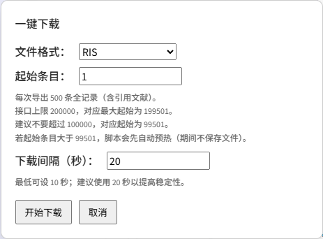
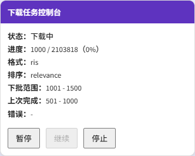
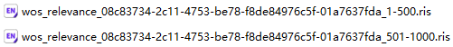

# WOS Download Bot Enhanced

Web of Science Core Collection 批量导出助手（油猴脚本增强版）

> 面向 Web of Science 核心合集检索结果页的批量导出工具。  
> 支持暂停 / 继续 / 停止 / 断点续传 / 自动预热 / 中断当前请求，适合大批量文献记录的分批导出。  
> 当前支持导出格式：**RIS / BibTeX / TXT**

---

## 功能特性

- 支持 **Web of Science Core Collection** 结果页批量导出
- 每批自动导出 **500 条记录**
- 支持 **暂停 / 继续 / 停止**
- 支持 **断点续传**
- 支持 **页面刷新后恢复任务**
- 支持 **超大起始条目自动预热**
- 支持 **中断当前网络请求**
- 自动记录任务进度到 `localStorage`
- 支持多种排序结果页：
  - relevance
  - recently-added
  - times-cited-descending
  - times-cited-ascending
  - date-descending
  - date-ascending

---

## 适用页面

本脚本适用于 Web of Science / Clarivate 的核心合集检索结果页，如：

- `https://*.webofscience.com/wos/woscc/summary/...`
- `https://*.clarivate.cn/wos/woscc/summary/...`


也就是说，你需要先进入 **检索结果列表页**，脚本才会显示「一键下载」按钮并工作（看不到刷新一下）。

检索结果列表页应从 Web of Science 高级检索（Advanced Search）页面形成，如：

- [https://webofscience.clarivate.cn/wos/woscc/basic-search](https://webofscience.clarivate.cn/wos/woscc/basic-search)
- [https://webofscience.clarivate.cn/wos/woscc/advanced-search](https://webofscience.clarivate.cn/wos/woscc/advanced-search)


---

## 安装方法

### 1. 安装油猴扩展

- [Tampermonkey](https://www.tampermonkey.net/)
- [篡改猴](https://www.crxsoso.com/webstore/detail/dhdgffkkebhmkfjojejmpbldmpobfkfo)

### 2. 安装脚本
将仓库中的js脚本文件导入油猴扩展，或使用发布后的安装链接。

---

## 使用方法

### 基本流程

1. 打开 Web of Science 核心合集检索结果页
2. 等待页面加载完成/刷新
3. 点击右侧 **“一键下载”**
4. 在弹窗中设置：
   - **文件格式**：RIS / BibTeX / TXT
   - **起始条目**
   - **下载间隔（秒）**
5. 点击 **“开始下载”**
6. 脚本会自动按 500 条一批依次导出



---

## 下载控制说明

脚本运行后，右侧会显示一个控制台，包含以下操作：

### 暂停
- 会在**当前批次完成后**暂停
- 不会丢失已完成进度

### 继续
- 从上次中断的位置继续下载
- 适用于：
  - 手动暂停后继续
  - 下载报错后恢复
  - 刷新页面后恢复任务

### 停止
- 会尝试中断当前请求
- **停止后会清空任务记录**
- 下次需要重新开始



---

## 断点续传机制

脚本会将当前任务信息保存到浏览器 `localStorage` 中，包括：

- 当前检索结果对应的任务标识
- 当前排序方式
- 已完成的导出范围
- 下一批要下载的范围
- 任务状态
- 最近一次错误信息

当你刷新页面，或者重新打开同一个检索结果页时，如果检测到未完成任务，脚本会提示你是否继续。

> 注意：只有当 **当前页面的检索结果和排序方式与原任务一致（网址完全相同）** 时，才允许恢复任务。

---

## 预热机制

当起始条目较大时，Web of Science 的接口稳定性通常会下降。  
因此脚本加入了 **预热模式**：

- 当起始条目 **大于 99501** 时
- 脚本会先从 `99501` 附近开始逐批请求进行“预热”
- 预热阶段 **不会保存文件**
- 预热完成后，才会跳转到你指定的起始条目开始正式下载

这个机制主要用于提升大范围后段数据导出的稳定性。

---

## 参数说明

### 每批导出数量
固定为：

- **500 条/批**

### 下载间隔
- 最低允许：**10 秒**
- 默认建议：**20 秒**
- 实际运行时会在设定值附近加入少量随机波动，以提高稳定性

### 起始条目限制
- 建议不要超过：**100000**
- 推荐直接起始的最大值：**99501**
- 接口硬上限对应的最大起始条目：**199501**

如果你的结果量特别大，建议先拆分（如按时间拆分），再分别导出。

---

## 文件命名规则

导出的文件名类似：

```text
wos_{sort}_{qid}_{start}-{stop}.{ext}


